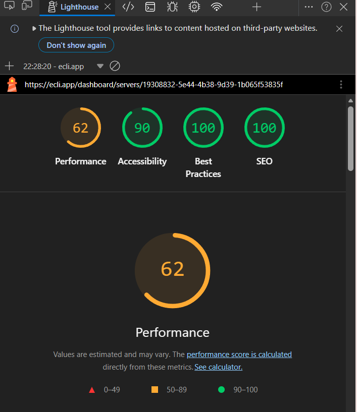
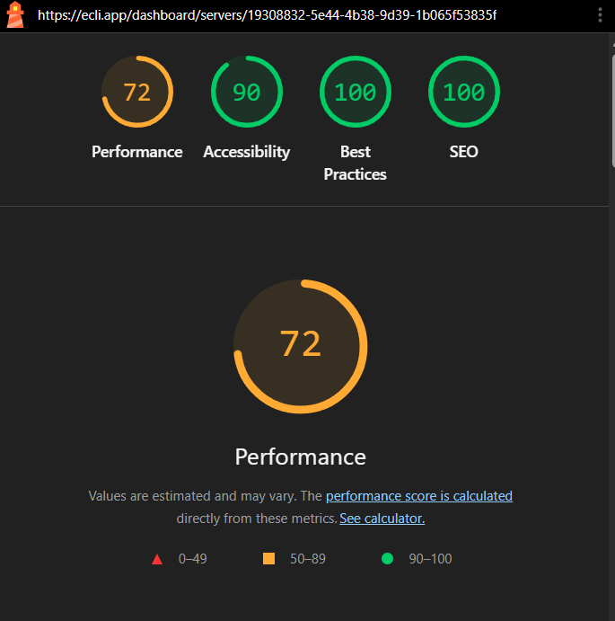

<p align="center">
  
</p>

# What is EcliPanel?
EcliPanel is an enterprise-grade server management platform with built-in DNS management for organisations,
team control, Docker support, and KVM (QEMU) virtualization.

It also includes integrated applications for staff workflows, feedback collection, and abuse reporting.
On top of that, EcliPanel offers AI-assisted features and a powerful anti-abuse detection system.

# Why was EcliPanel v3 made?
EcliPanel v3 is a complete rewrite of the original EcliPanel v1, which itself was built on top of the Jexactyl panel. Maintenance of EcliPanel v1 was not possible due to its size and architecture.

# What is our goal?
The goal of this iteration is to provide a fully in‑house backend and modernized frontend while keeping the codebase open source for non-commercial use.

# You're already interested?
Want to see more than code? Check out the showcase [by clicking here](/SHOWCASE.md) or by visiting [hosting that uses EcliPanel v3 in production](https://ecli.app/).

# Structure
This repository contains four folders:

- `/backend` – Elysia/Bun panel API interacting with Wings nodes and
  MariaDB.
- `/frontend` – Next.js (React) application. Pages communicate with the
  backend (and optionally directly with Wings) via helpers and etc.
- `/antiabuse` – Rust-based anti-abuse detection daemon that runs on every node to stop DDoS, port scanning, crypto mining, and Nezha proxies.
- `/systemd` – Systemd unit files.

## Running the stack

1. **Install Wings**
We use wings-rs (https://github.com/calagopus/wings) and develop around it.
You may **NOT** use wings-go (Pterodactyl stock) as most features will not work!

After installing Wings, complete the backend and frontend setup, then start them.

2. **Start backend**
   ```powershell
   cd backend
   # Bun is recommended since it runs the TypeScript directly, but..
   bun install      # or `pnpm install`/`npm install` if you prefer
   sudo apt install ffmpeg # if using captcha
   sudo apt install espeak # if using captcha
    bun run gen:jwt-secret    # generate all secrets needed by .env and set them manually!
    bun run gen:pq-jwt-seed   # generate PQ_JWT_SEED for ML-DSA-65 signed tokens
    bun -e "console.log((await import('crypto')).randomBytes(64).toString('base64'))" # generate NODE_PQ_ENCRYPTION_SEED
   nano .env              # edit .env (see .env.example)
   bun run gen:default-role # create default role
   # for development you can simply run:
   bun src/index.ts
   # or use the helper scripts which choose Bun when available:
   ./build.sh      # compiles TS for Node if needed (skip if using Bun; Node is untested!)
   ./start.sh      # launches the server (run this directly if using Bun)
   ```
   Backend listens on specified port (see `.env`).
   It serves the REST API, handles multi-node mapping, and proxies WebSocket connections to Wings servers, etc.

3. **Start frontend**
   ```bash
   cd frontend
   pnpm install
   nano .env # edit .env (see .env.example)
   nano lib/panel-config.ts # edit panel config, branding, etc.
   ./dev.sh --port 3000 # start in dev mode (--port is optional)
   ./start.sh --port 3000 # start in production mode (--port is optional)
   ```
   Frontend will run on http://localhost:3000 and automatically proxy
   `/api/*` requests to the backend and `/wings/*` to the Wings node(s)
   via `next.config.mjs` rewrites. Set environment variables to function properly!

> ⚠️ Remember to set `.env` variables for production (database, auth secrets, API base URL, etc.).
>     For production deployments use a reverse proxy like Nginx.

### Backend scripts

The backend includes a couple of helper scripts used during setup.

- **Seed default permissions** — creates the `rootAdmin` role and grants full permissions (including `*`).

  ```bash
  cd backend
  bun run seed
  ```

- **Generate PQ_JWT_SEED** — creates a 64-byte seed for deterministic ML-DSA-65 key generation (post-quantum signed tokens).

  ```bash
  cd backend
  bun run gen:pq-jwt-seed
  ```

  Add the output `PQ_JWT_SEED` to your `.env`. Without it, a random keypair is generated at each startup (invalidating all existing tokens on restart).

- **Promote a user** — set an existing user to `rootAdmin` (or another role).

  ```bash
  cd backend
  bun run promote -- <email> [role]
  ```

  Examples:

  ```bash
  bun run promote -- admin@example.com
  bun run promote -- admin@example.com rootAdmin
  bun run promote -- admin@example.com admin
  ```

### Useful commands

```bash
# run backend locally
cd backend && ./start.sh

# run frontend locally (dev)
cd frontend && bun run dev

# run frontend locally (prod)
cd frontend && bun run build # build
bun run start # start
```

### Optional: systemd setup

Systemd unit files are included in the `/systemd` folder — these are used for the https://ecli.app/ production deployment. Feel free to use them for your own production deployment, but update the paths accordingly!

### Notes

- The backend uses the `.env` file in `backend/`.
- The frontend uses `.env` in `frontend/`.

## Notes

- The API routes are documented at `example.com/openapi` and should be used by the
  frontend code.
- You might need to run `npm rebuild @tensorflow/tfjs-node --build-from-source` in backend to make selfie verification work!

> You may view API routes without deploying at https://backend.ecli.app/openapi for production or https://backend.canary.ecli.app/openapi for canary.
> The Canary version of EcliPanel is offline during non-development periods.

## Optimization
Here is a small overview of the optimisations we have done!
- `frontend/lib/api-client.ts`
  - We implemented in-memory GET caching with `API_CACHE_TTL = 60s`.
  - Cache hits avoid repeated REST downloads for frequent read operations.
- `frontend/app/dashboard/servers/[id]/page.tsx`
  - Added `useMemo` around stats history data (`chartData`) to avoid recomputing on every render.
  - Already existing lazy loading of heavy dependencies (`@monaco-editor/react`, `recharts`) is now leveraged more aggressively in tab usage patterns, so the app initial bundle reduces first paint cost.

## Optimization Results (observed)
- Repeated dashboard refresh calls for mostly-read endpoints now hit the JS cache and skip server round trips for the 60s window, improving UX.
- Stats tab no longer recomputes chart data on unrelated state changes — CPU usage and React render churn go down! (YAY)
- Page load initial rendering is faster in cold loads because Monaco and the charting engine only download when needed.

### Optimization visual comparison
Before and after optimization showed performance improvements of 10–20 points on most pages!

<p float="left">
  
  
</p>

## Star History

<a href="https://www.star-history.com/?repos=thenoname-gurl%2FEcliPanel&type=date&legend=top-left">
 <picture>
   <source media="(prefers-color-scheme: dark)" srcset="https://api.star-history.com/chart?repos=thenoname-gurl/EcliPanel&type=date&theme=dark&legend=top-left" />
   <source media="(prefers-color-scheme: light)" srcset="https://api.star-history.com/chart?repos=thenoname-gurl/EcliPanel&type=date&legend=top-left" />
   
 </picture>
</a>

Happy exploring!
>Side note: 
> This project took part in [Flavortown](https://flavortown.hackclub.com/projects/15802?ref=eclipsesystems) and in [Macondo](https://macondo.hackclub.com/projects/506?ref=HHDFS)!
> I do not get paid for developing this and entire hosting is not profitable enough to cover development costs,
> if you really liked the panel at least star the repo or go order something from us https://ecli.app/