

  

# EcliPanel - Showcase

This is a concise showcase and overview of the EcliPanel project. This document highlights the platform's features, architecture, and provides a gallery of UI screenshots.

## What is EcliPanel

EcliPanel is a full-featured game server control panel and orchestration platform. It provides teams and organizations a secure, multi-tenant interface to manage game servers, users, billing, DNS, AI endpoints, and integrations to remote Wings nodes (the agent daemon).

## Key Features

- Multi-tenant organizations & roles: user, admin, organisation management
- Authentication & sessions, email verification, API keys
- Server lifecycle management: create, start/stop, install, backup
- Wings integration: HTTP + WebSocket proxying to remote agents
- Billing, plans, and order management
- Ticketing and audit/logs
- DNS management and domain provisioning
- SSH key management and subuser support
- AI endpoints and request/usage tracking
- Uploads, document verification, and admin tools
- And much more

## Architecture Summary

- Backend: Bun + Elysia.js (TypeScript) — REST and WebSocket APIs
- Frontend: Next.js 16 (App Router) with shadcn/ui and Tailwind CSS
- Wings: Rust-based agent (external project) — manages game servers on host nodes
- Database: MariaDB and Redis for sessions/caching
- Communication: backend proxies API and WS traffic to Wings nodes; frontend talks to backend via `api-client`

## Quick Start (for developers)

1. Backend: run `backend/start.sh` (dev) or `backend/build.sh` (build).
2. Frontend: run `frontend/dev.sh` (dev) or `frontend/start.sh` (prod).
3. Wings: located in `wings/wings-main` (Rust/Compose), runs separately.

Refer to the repository README for detailed environment setup and secrets.

## Screenshots / Visual Showcase

All screenshots are stored in the `showcase/` folder. Below is a gallery of every file currently present in that folder.

> **Tip:** If you want the images rendered in a GitHub preview, keep the `showcase/` folder at the repo root.

### Account

### Admin

### Core Panel

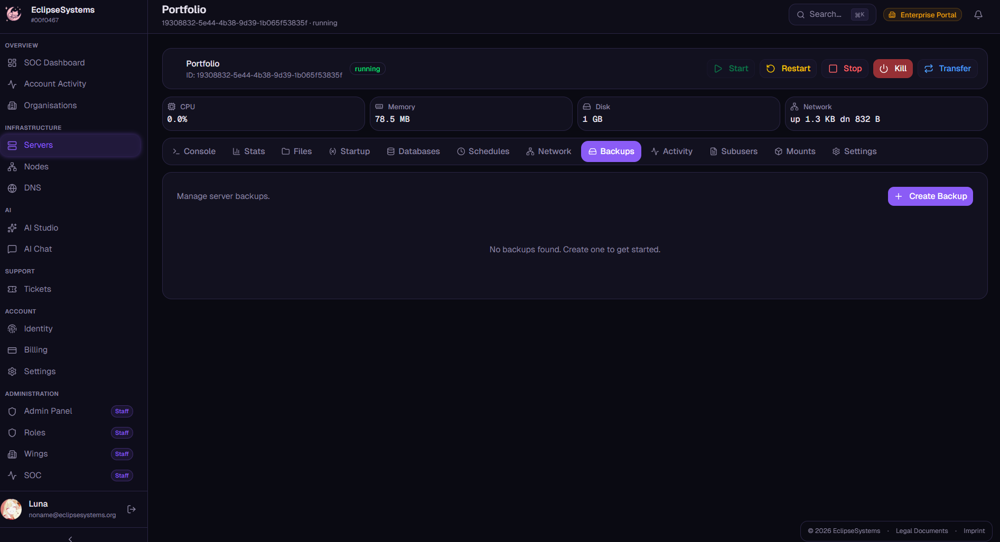
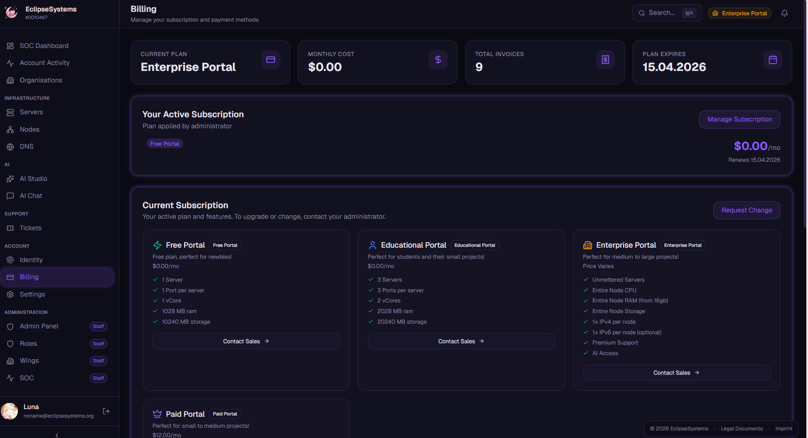
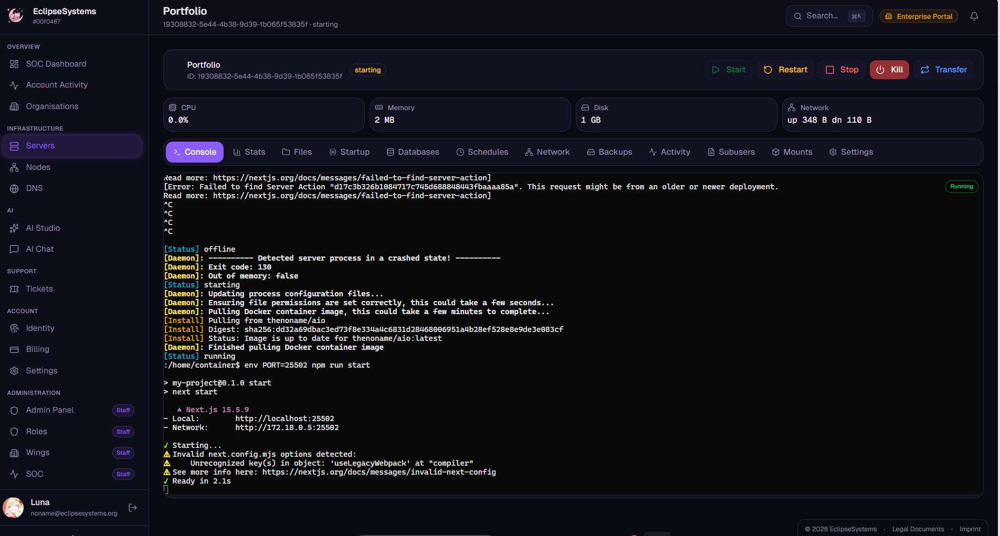
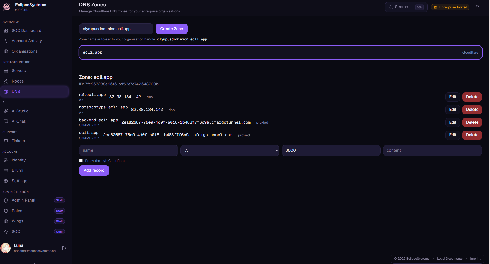
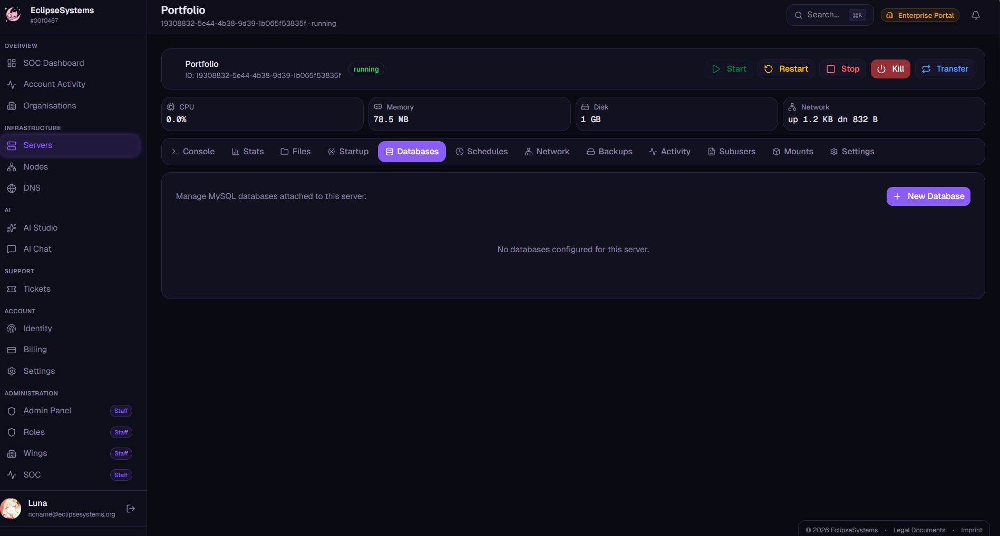
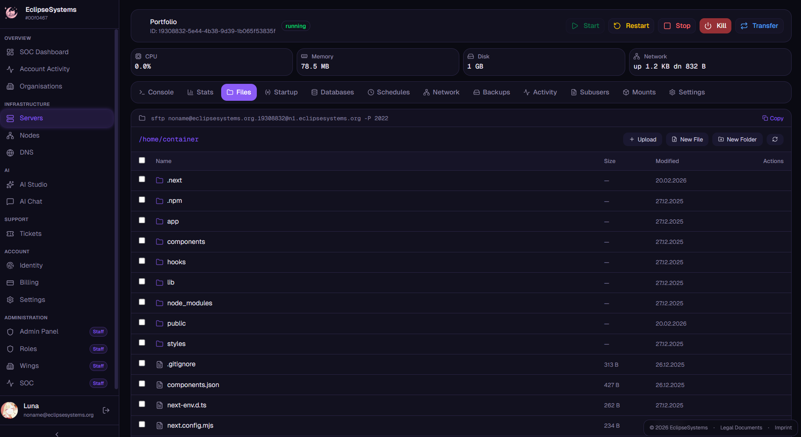
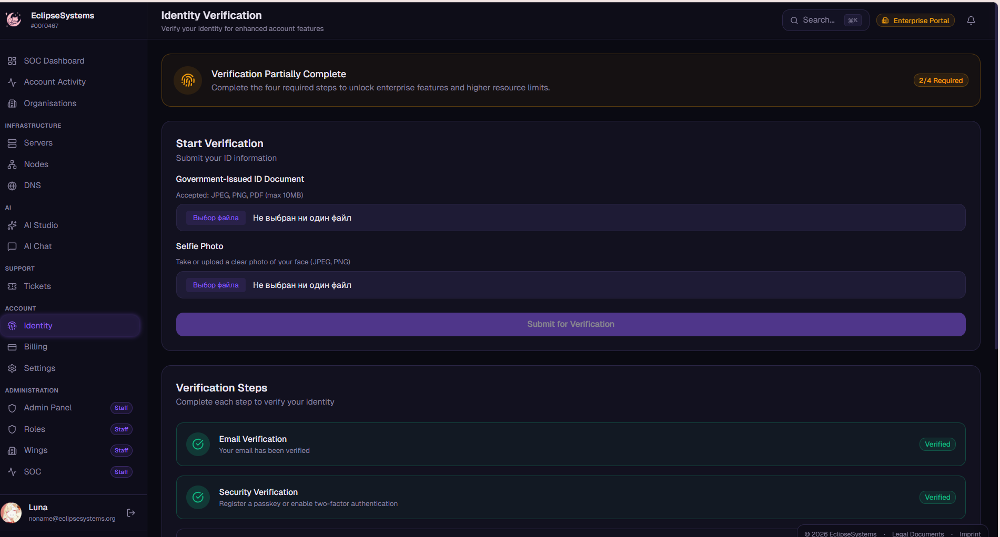
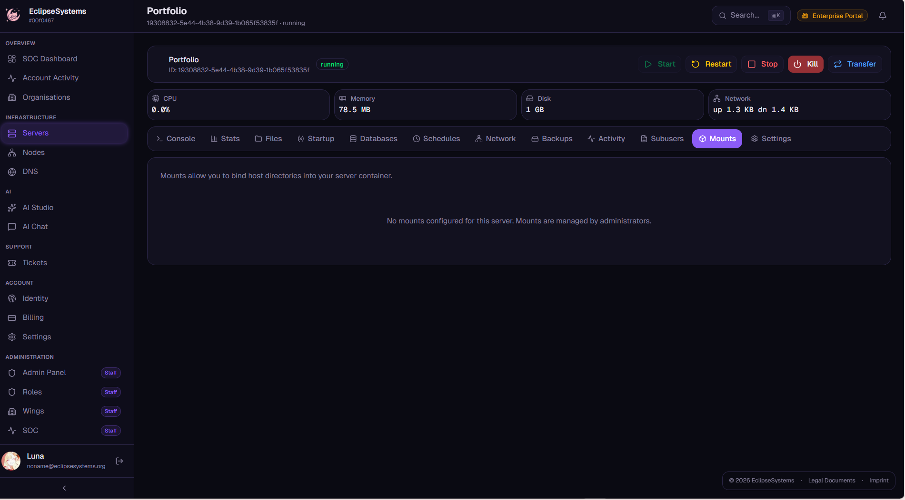
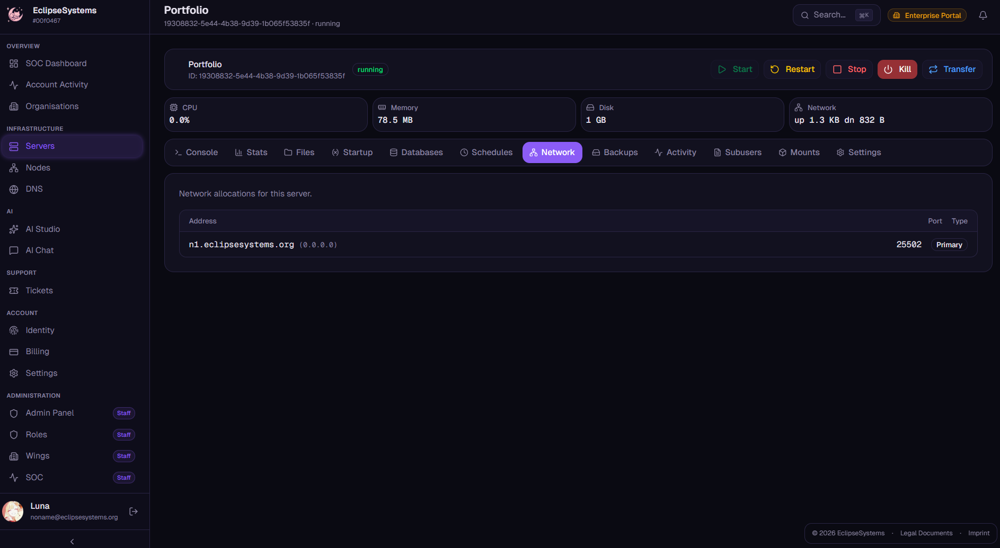
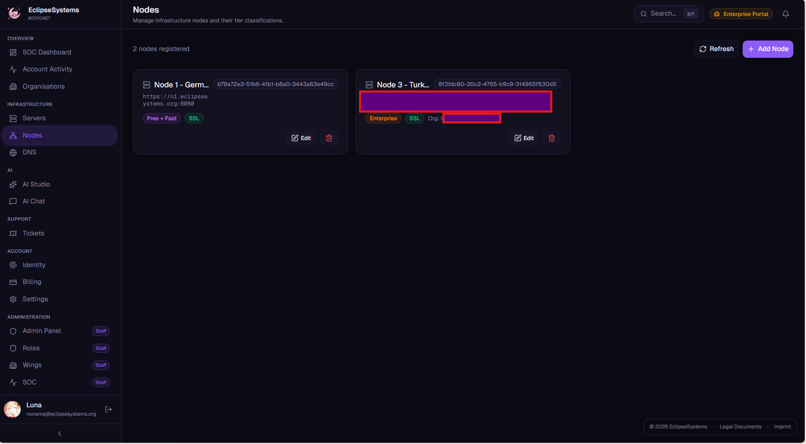

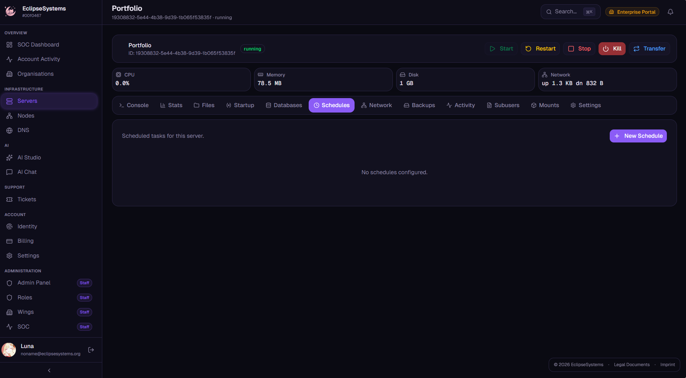

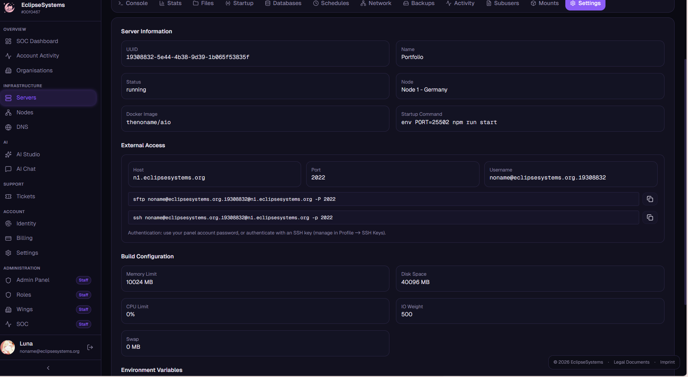
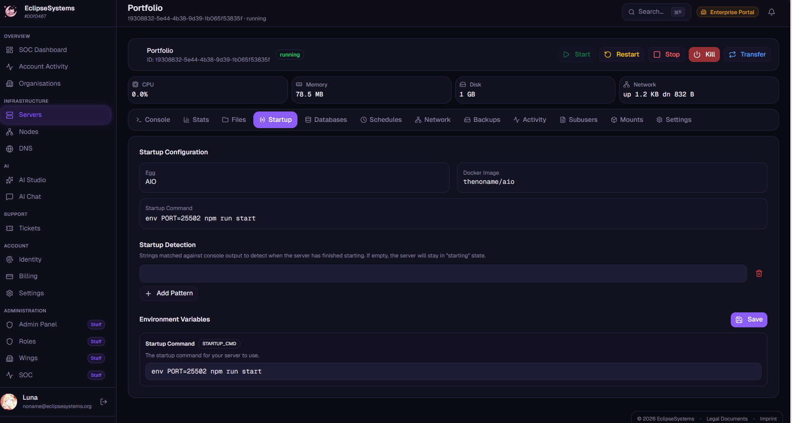
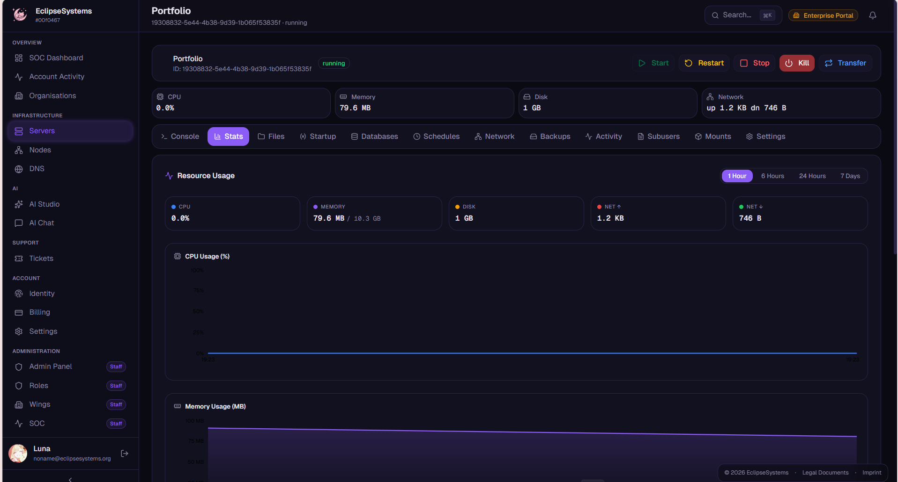
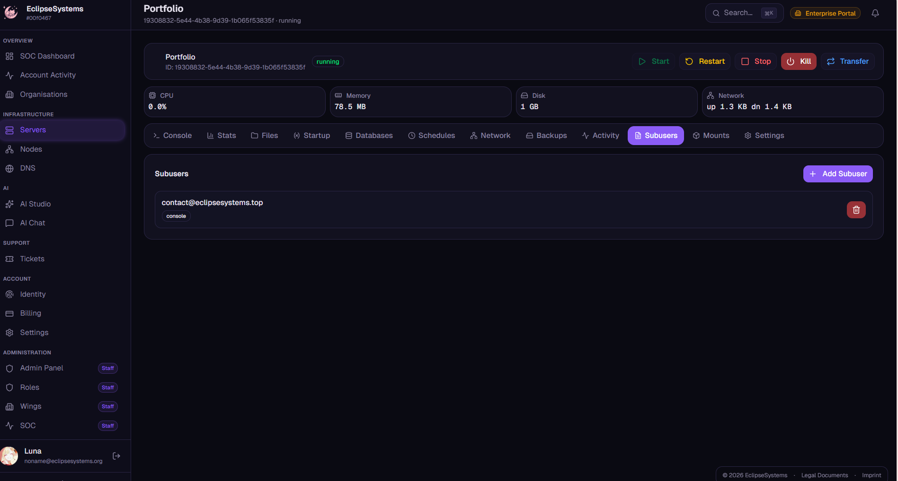
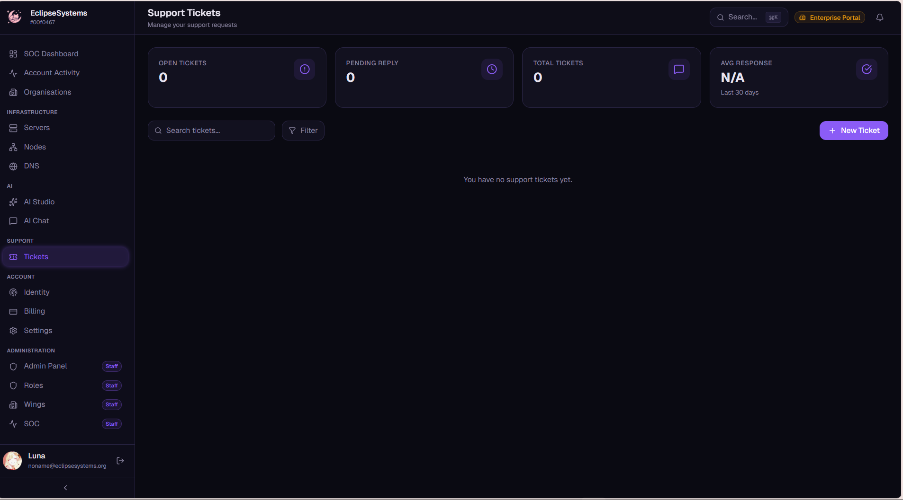

> Notes for images:
> - All images in this document are located in `showcase/`.
> - Certain images are modified to hide sensetive data.
